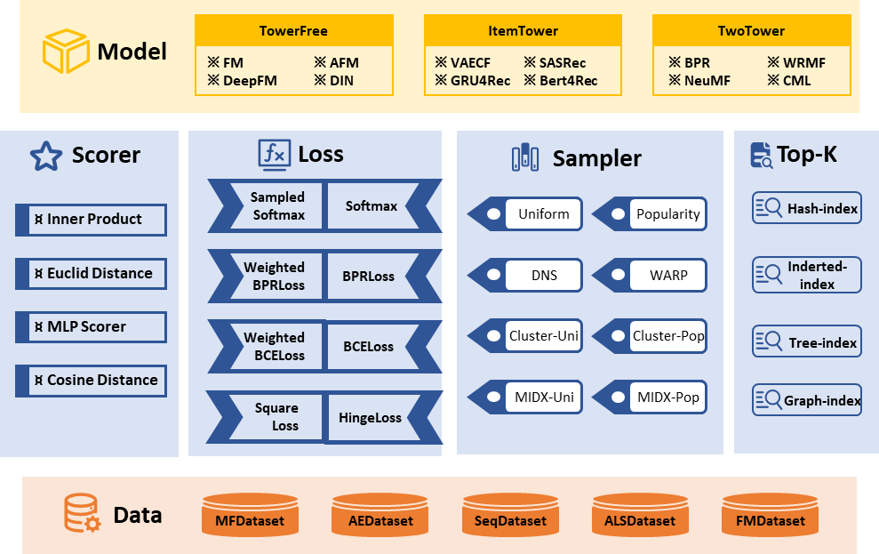

# RecStudio


<p float="left">


<!--  -->

</p>
<p align="left">
  
  <br>
</p>

RecStudio is a unified, highly-modularized and recommendation-efficient recommendation library based on PyTorch. All the algorithms are 
categorized as follows according to recommendation tasks.
- General Recommendation
- Sequential Recommendation
- Knowledge-based Recommendation
- Feature-based Recommendation
- Social Recommendation

## Description

### Model Structure

At the core of the library, all recommendation models are grouped into three base classes:

- `TowerFreeRecommender`: The most flexible base class, which enables any complex feature-interaction modeling.
- `ItemTowerRecommender`: Item encoders are separated from recommender, enabling fast ANN and model-based negative sampling.
- `TwoTowerRecommender`: The subclass of `ItemTowerRecommender`, where recommenders only consist of user encoder and item encoder.

### Dataset Structure

For the dataset structure, the datasets are divided into five categories:

|Dataset    |Application   | Examples  |
|-----------|-----------|----------|
|MFDataset|Dataset for providing user-item-rating triplet|BPR, NCF, CML et al.|
|AEDataset|Dataset for AutoEncoder-based ItemTowerRecommender|MultiVAE, RecVAE, et al.|
|SeqDataset|Dataset for Sequential recommenders with Causal Prediction|GRU4Rec, SASRec, et al.|
|Seq2SeqDataset|Dataset for Sequential recommenders with Masked Prediction|Bert4Rec, et al.|
|ALSDataset|Dataset for recommenders optimized by alternating least square |WRMF, et al.|

In order to accelerate dataset processing, processed dataset are automatically cached for repeatable training shortly.


### Model Evaluation

Almost all common metrics used in recommender systems are implemented in RecStudio based on PyTorch, such as `NDCG`, `Recall`, `Precision`, et al. All metric functions have the same interface, being fully implemented with tensor operators. Therefore, the evaluation procedure can be moved to GPU, leading to a remarkable speedup of evaluation.


### ANNs & Sampler

In order to accelerate training and evaluation, RecStudio integrates various Approximate Nearest Neighbor
search (ANNs) and negative samplers. By building indexes with ANNs, the topk operator based on Euclidean distance, inner product and cosine similarity can be significantly accelerated. Negative samplers consist of static sampler and model-based samplers developed by RecStudio
team. Static samplers consist of `Uniform Sampler` and `Popularity Sampler`. The model-based samplers are based on either quantization of item vectors or importance resampling. Moreover, we also implement static sampling in the dataset, which enables us to generate negatives when loading data.

### Loss & Score

In RecStudio, loss functions are categorized into three types:
    - `FullScoreLoss`: Calculating scores on the whole items, such as `SoftmaxLoss`.
    - `PairwiseLoss`: Calculating scores on positive and negative items, such as `BPRLoss`, 
    `BinaryCrossEntropyLoss`, et al.
    - `PointwiseLoss`: Calculating scores for a single (user, item) interaction, such as `HingeLoss`.

Score functions are used to model users' preference on items. Various common score functions are 
implemented in RecStudio, such as `InnerProduct`, `EuclideanDistance`, `CosineDistance`, `MLPScorer`,
et al. 

| Loss | Math Type | Sampling Distribution | Calculation Complexity | Sampling Complexity | Convergence Speed | Related Metrics |
| :--- | :--- | :--- | :--- | :--- | :--- | :--- |
| Softmax | <!-- $-\log \frac{\exp f_{\theta}(c, {\color{red}k})}{\sum_{i=1}^{N} \exp f_{\theta}(c, i)}$ -->   | No sampling | <!-- $O(N)$ -->  | - | very fast | NDCG |
| Sampled Softmax | <!-- $-\log \frac{\exp \left(f_{\theta}(c, {\color{red}k})-\log Q({\color{red}k} \mid c)\right)}{\sum_{i \in S \cup\{k\}} \exp \left(f_{\theta}(c, i)-\log Q(i \mid c)\right)}$ -->  | No sampling | <!-- $O(N)$ -->  | - | fast | NDCG |
| BPR | <!-- $-\log \left(\sigma\left(f_{\theta}(c, {\color{red}k})-f_{\theta}(c, {\color{red}j})\right)\right)$ -->  | Uniform sampling | <!-- $O(1)$ -->  | <!-- $O(1)$ -->  | slow | AUC |
| WARP | <!-- $L\left(\left\lfloor \frac{Y-1}{N}\right\rfloor\right)\lvert 1-f_{\theta}(c, {\color{red}k})+f_{\theta}(c, {\color{red}j})\rvert_{+}$ -->  | Reject Sampling | <!-- $O(1)$ -->  | slower and slower | slow | Precision |
| InfoNCE | <!-- $-\log \frac{\exp \left(f_{\theta}(c, {\color{red}k})\right)}{\sum_{i \in S \cup\{k\}} \exp \left(f_{\theta}(c, i)\right)}$ -->  | Popularity sampling | <!-- $O(\lvert S\rvert)$ -->  | <!-- $O(1)$ -->  | fast | DCG |
| WRMF | <!-- $\sum_{j} {\color{red}w_{c j}}\left(f_{\theta}(c, j)-y(c, j)\right)^{2}$ -->  | No sampling | <!-- $O(N)$ -->  | - | very fast | - |
| PRIS | <!-- $-\sum_{j \in S} \frac{\exp \left(f_{\theta}(c, {\color{red}j})-\log Q({\color{red}j} \mid c)\right)}{\sum_{{j^{\prime}} \in S} \exp \left(f_{\theta}\left(c, {j^{\prime}}\right)-\log Q\left({j^{\prime}} \mid c\right)\right)} \log \left(\sigma\left(f_{\theta}(c, {\color{red}k})-f_{\theta}(c, {\color{red}j})\right)\right)$ -->  | Cluster sampling | <!-- $O(\lvert S\rvert)$ -->  | <!-- $O(K)$ -->  | very fast | DCG |


<p align="center">
  
  <br>
  <b>Figure</b>: RecStudio Framework
</p>


## Features

- **General Dataset Structure** A unified dataset config based on atomic data files and automatic data cache
are supported in RecStudio.
- **Modular Model Structure** By organizing the whole recommender into different modules, loss functions, scoring 
functions, samplers and ANNs, you can customize your model like building blocks.
- **GPU Acceleration** The whole operation from model training to model evaluation could be easily moved to
on GPUs and distributed GPUs for running.
- **Simple Model Categorization** RecStudio categorizes all the models based on the number of encoders,
which is easy to understand and use. The taxonomy can cover all models.
- **Simple and Complex Negative Samplers** RecStudio integrates static and model-based samplers with only tensor operators.


## Quick Start
By downloading the source code, you can run the provided script `run.py` for initial usage of RecStudio.

```bash
python run.py
```

The initial config will train and evaluate BPR model on MovieLens-100k(ml-100k) dataset.

Generally speaking, the simple example will take less than one minute with GPUs. And the output will be
like below:

```bash
[2022-04-11 14:30:29] INFO (faiss.loader/MainThread) Loading faiss with AVX2 support.
[2022-04-11 14:30:29] INFO (faiss.loader/MainThread) Loading faiss.
[2022-04-11 14:30:29] INFO (faiss.loader/MainThread) Successfully loaded faiss.
[2022-04-11 14:30:30] INFO (pytorch_lightning.utilities.seed/MainThread) Global seed set to 42
[2022-04-11 14:30:30] INFO (pytorch_lightning/MainThread) learning_rate=0.001
weight_decay=0
learner=adam
scheduler=None
epochs=100
batch_size=2048
num_workers=0
gpu=None
ann=None
sampler=None
negative_count=1
dataset_sampling_count=None
embed_dim=64
item_bias=False
eval_batch_size=20
split_ratio=[0.8, 0.1, 0.1]
test_metrics=['recall', 'precision', 'map', 'ndcg', 'mrr', 'hit']
val_metrics=['recall', 'ndcg']
topk=100
cutoff=10
early_stop_mode=max
split_mode=user_entry
shuffle=True
use_fields=['user_id', 'item_id', 'rating']
[2022-04-11 14:30:30] INFO (pytorch_lightning/MainThread) save_dir:/home/RecStudio/
[2022-04-11 14:30:30] INFO (pytorch_lightning.utilities.distributed/MainThread) GPU available: True, used: False
[2022-04-11 14:30:30] INFO (pytorch_lightning.utilities.distributed/MainThread) TPU available: False, using: 0 TPU cores
[2022-04-11 14:30:30] INFO (pytorch_lightning.utilities.distributed/MainThread) IPU available: False, using: 0 IPUs
[2022-04-11 14:30:30] INFO (pytorch_lightning.utilities.distributed/MainThread) The following callbacks returned in `LightningModule.configure_callbacks` will override existing callbacks passed to Trainer: ModelCheckpoint
[2022-04-11 14:30:30] INFO (pytorch_lightning.core.lightning/MainThread) 
  | Name         | Type               | Params
----------------------------------------------------
0 | loss_fn      | BPRLoss            | 0     
1 | score_func   | InnerProductScorer | 0     
2 | item_encoder | Embedding          | 107 K 
3 | sampler      | UniformSampler     | 0     
4 | user_encoder | Embedding          | 60.4 K
----------------------------------------------------
168 K     Trainable params
0         Non-trainable params
168 K     Total params
0.673     Total estimated model params size (MB)
[2022-04-11 14:30:30] INFO (pytorch_lightning.callbacks.early_stopping/MainThread) Metric recall@10 improved. New best score: 0.007
[2022-04-11 14:30:30] INFO (pytorch_lightning/MainThread) Training: Epoch=  0 [recall@10=0.0074 ndcg@10=0.0129 train_loss=0.6932]
[2022-04-11 14:30:31] INFO (pytorch_lightning.callbacks.early_stopping/MainThread) Metric recall@10 improved by 0.006 >= min_delta = 0.0. New best score: 0.014
[2022-04-11 14:30:31] INFO (pytorch_lightning/MainThread) Training: Epoch=  1 [recall@10=0.0135 ndcg@10=0.0251 train_loss=0.6915]
[2022-04-11 14:30:32] INFO (pytorch_lightning.callbacks.early_stopping/MainThread) Metric recall@10 improved by 0.038 >= min_delta = 0.0. New best score: 0.051
...
[2022-04-11 14:31:26] INFO (pytorch_lightning/MainThread) Training: Epoch= 75 [recall@10=0.2074 ndcg@10=0.2942 train_loss=0.1909]
[2022-04-11 14:31:26] INFO (pytorch_lightning.callbacks.early_stopping/MainThread) Monitored metric recall@10 did not improve in the last 10 records. Best score: 0.211. Signaling Trainer to stop.
[2022-04-11 14:31:26] INFO (pytorch_lightning/MainThread) Training: Epoch= 76 [recall@10=0.2073 ndcg@10=0.2949 train_loss=0.1899]
[2022-04-11 14:31:26] INFO (pytorch_lightning.utilities.distributed/MainThread) The following callbacks returned in `LightningModule.configure_callbacks` will override existing callbacks passed to Trainer: EarlyStopping, ModelCheckpoint
[2022-04-11 14:31:27] INFO (pytorch_lightning/MainThread) Testing:  [recall@10=0.2439 precision@10=0.1893 map@10=0.5762 ndcg@10=0.3718 mrr@10=0.4487 hit@10=0.7815]
```

If you want to change models or datasets, command line is ready for you.
```bash
python run.py -m=NCF -d=ml-1m 
```

- Supported command line arguments:

  |args|type|description|default|optional|
  |---|---|---|---|---|
  |-m,--model| str|model name|BPR|all the models in RecStudio|
  |-d,--dataset|str|dataset name|ml-100k|all the datasets supported by RecStudio|
  |--data_dir|str|dataset folder|datasets|folders that could be read by RecStudio|
  |mode|str|training mode|light|['light','detail','tune']|
  |--learning_rate|float|learning rate|0.001||
  |--learner|str|optimizer name|adam|['adam','sgd','adasgd','rmsprop','sparse_adam']|
  |--weight_decay|float|weight decay for optimizer|0||
  |--epochs|int|training epoch|20,50||
  |--batch_size|int|the size of mini batch in training|2048||
  |--eval_batch_size|int|the size of mini batch in evaluation|128||
  |--embed_dim|int|the output size of embedding layers|64||


- For `ItemTowerRecommender`, some extra args are supported:

  |args|type|description|default|optional|
  |---|---|---|---|---|
  |--sampler|str|sampler name|uniform|['uniform','popularity','midx_uni','midx_pop','cluster_uni','cluster_pop']|
  |--negative_count|int|number of negative samples|1|positive integer|

- For `TwoTowerRecommender`, some extra args are supported based on `ItemTowerRecommender`:

  |args|type|description|default|optional|
  |---|---|---|---|---|
  |--split_mode|str|split methods for the dataset|user_entry|['user','entry','user_entry']|

Here are some details of some unclear arguments.
  > 1. `mode`: in `light` mode and `detail` mode, the output will displayed on the terminal, while 
  the latter provide more detailed info. `tune` mode will use Neural Network Intelligence(NNI) to show 
  a beautiful visual interface. You can run `tune.sh` with a config file like `config.yaml`. For
  more details about NNI, please refer to [NNI Documentation](https://nni.readthedocs.io/zh/stable/).
  > 2. `sampler`: `uniform` stands for UniformSampler is used. `popularity` stands for sampling according
  to the item popularity (more popular items are sampled with higher probabilities). `midx_uni`,`midx_pop`
  are `midx` dynamic sampler, please refer to [FastVAE](https://arxiv.org/abs/2109.05773) for more details.
  `cluster_uni`,`cluster_pop` are `cluster` dynamic sampler, please refer to
  [PRIS](https://dl.acm.org/doi/10.1145/3366423.3380187) for more details.
  > 3. `split_mode`: `user` means splitting all users into train/valid/test datasets, users in
  those datasets are disjoint. `entry` means spliting all the interactions in those three dataset.
  `user_entry` means spliting interaction of each user into three parts. 


Also, you can install RecStudio from PyPi:

```bash
pip install recstudio
```

For basic usage like below:

```python
import recstudio
recstudio.run(model="BPR", data_dir="./datasets/", dataset='ml-100k')
```

For more detailed information, please refer to our documentation https://recstudio.readthedocs.io/.

## Automatic Hyper-parameter Tuning
RecStudio integrates with NNI module for tuning the hype-parameters automatically. For easy usage,
you can run `tune.sh` script with your specific config file like the provided file `config.yaml`.

For more detailed information about NNI, please refer to
[NNI Documentation](https://nni.readthedocs.io/zh/stable/).


## Contributing
Please let us know if you encounter a bug or have any suggestions by
[submitting an issue](https://github.com/ustcml/RecStudio/issues).

We welcome all contributions from bug fixes to new features and extensions.

We expect all contributions firstly discussed in the issue tracker and then going through PRs.


## The Team
RecStudio is developed and maintained by USTC BigData Lab.

|User|Contributions|
|---|---|
|@[DefuLian](https://github.com/DefuLian)|Framework design and construction|
|@[AngusHuang17](https://github.com/AngusHuang17)|Sequential model, docs, bugs fixing|
|@[Xiuchen519](https://github.com/Xiuchen519)|Knowledge-based model, bugs fixing|
|@[JennahF](https://github.com/JennahF)|NCF,CML,logisticMF models|
|@[HERECJ](https://github.com/HERECJ)|AutoEncoder models|
|@[BinbinJin](https://github.com/BinbinJin)|IRGAN model|


## License
RecStudio uses [MIT License](./LICENSE).
